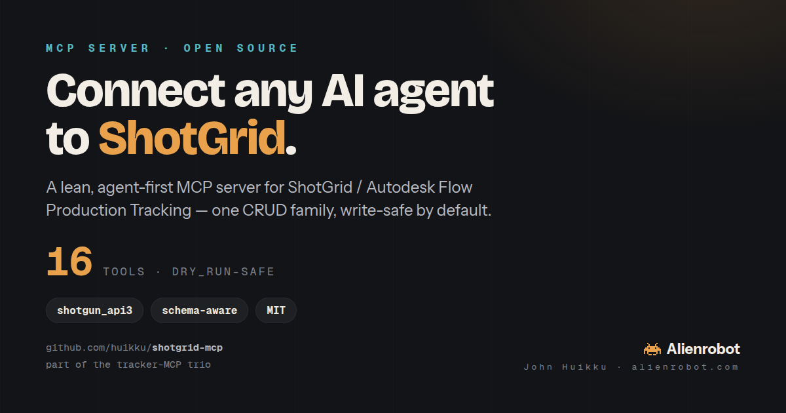

# ShotGrid MCP server (lean)



A **Model Context Protocol** server that gives LLM agents (Claude Desktop, Claude Code, Cursor, …) full
access to the **ShotGrid / Autodesk Flow Production Tracking** API through a **small, curated, agent-first
tool surface**. A leaner, write-safe repackaging of
[`loonghao/shotgrid-mcp-server`](https://github.com/loonghao/shotgrid-mcp-server) (credit below).

> ShotGrid is schema-driven, so a handful of **generic CRUD + query tools reach every entity type**. This
> server leans into that: **16 tools, one CRUD family, a `dry_run` safety gate on every write.**

## Built on the shoulders of `loonghao/shotgrid-mcp-server`
This project owes a real debt to **[`loonghao/shotgrid-mcp-server`](https://github.com/loonghao/shotgrid-mcp-server)**
(MIT) — the first solid, well-engineered ShotGrid MCP. We used it heavily and it works: connection pooling,
a schema cache, an `error_handler`, and `mockgun`-based tests are all things it gets right, and it proved the
concept. **Go star it.** This server isn't a replacement so much as a **leaner, hardened repackaging** of the
same idea, tuned specifically for **autonomous agents** — where a tighter, safer tool surface matters more
than breadth.

### What we changed to make it more solid
Three changes, each aimed at making an agent's life safer and more predictable:

| In the original | What we did here — and why it's more solid |
|---|---|
| **~60 tools across two overlapping CRUD families** (`sg_find`/`find_one_entity`, `sg_create`/`create_entity`, `sg_batch`/`batch_operations`) **plus `*_tool` alias duplicates**. | **Consolidated to one CRUD family** — `find` / `find_one` / `create` / `update` / `delete` / `revive` / `batch`, **16 tools total**. Fewer, unambiguous tools = the model picks the right one every time and spends far less context deciding. |
| **Writes commit immediately**; the only guard against an accidental `delete`/`update` is docstring text. | **A `dry_run` flag on every write** (`create`, `update`, `delete`, `batch`). `dry_run=true` returns exactly what *would* happen and commits nothing — so an agent (or a human) can preview before pulling the trigger. `delete` is also a **reversible retire** (undo with `revive`), documented as such. |
| **Studio-specific tools in the core** (`find_vendor_users`, `find_vendor_versions`, `create_vendor_playlist`) + thin canned-filter wrappers (`find_recent_playlists`, `find_project_playlists`, …) that assume one shop's schema/conventions. | **Removed** — anything they did is one `find`/`create` with explicit filters. No hidden assumptions about a site's status lists or naming, so it behaves identically on any ShotGrid instance. |

Net: **same 100% reach** (both are generic over ShotGrid's schema), a fraction of the tool count, and
**safe-by-default writes**. Where the original optimizes for human convenience and breadth, this one optimizes
for an agent that needs to choose correctly and not break things.

## The 16 tools
**Generic power tools (full reach over every entity type):**
- `find` · `find_one` — query with ShotGrid filters + field projections
- `create` · `update` · `delete` · `revive` — single-entity writes (`delete` = reversible retire)
- `batch` — atomic multi-op create/update/delete

**Schema & discovery (so the agent can learn the site first):**
- `schema_entity_read` — all entity types
- `schema_field_read` — fields + types for one entity type
- `summarize` — server-side aggregation / status roll-ups (no rows pulled)
- `text_search` — global text search across entity types

**High-value helpers (not just a canned filter):**
- `whoami` — connection + server info
- `find_projects` — common entry point
- `project_summary` — a **normalized** project snapshot (counts + per-shot cast/status/thumbnail, canonical statuses) for cross-tracker verify/diff
- `download_thumbnail` — pull an entity's thumbnail/filmstrip to disk
- `upload` — attach a file / set a thumbnail / fill a media field

Every write tool takes `dry_run` (default `false`). `create` / `update` / `delete` support **two preview
levels**: `dry_run="plan"` (client-side echo, no server contact) and **`dry_run="preflight"`** — a *real*
dry run that resolves every referenced entity against live data, validates `sg_status_list` values against
the live schema, returns a before→after diff for updates, and a `verdict` of `ok`/`would_fail` — **without
writing**. Set `MCP_PLAN_LOG=/path.jsonl` to capture each plan/preflight as a reviewable plan file. (Other
write tools take `dry_run` as a plain boolean.)

## Install
```bash
pip install -r requirements.txt        # fastmcp, shotgun_api3, requests
```

## Configure (credentials)
Create a **Script** in ShotGrid (Admin ▸ Scripts ▸ *+ Add Script*) and set three env vars (or pass them in
your MCP client config):

| var | value |
|---|---|
| `SHOTGRID_URL` | `https://yourstudio.shotgrid.autodesk.com` |
| `SHOTGRID_SCRIPT_NAME` | the Script's name |
| `SHOTGRID_API_KEY` | that Script's **Application Key** |

For local dev you can instead drop them in a `.env` next to `server.py` (gitignored — see `.env.example`).

## Run / wire into a client
```bash
python3 server.py        # stdio transport
```
Claude Code:
```bash
claude mcp add shotgrid -- python3 /path/to/shotgrid-mcp/server.py
```
Claude Desktop / Cursor (`mcpServers` entry):
```json
{
  "mcpServers": {
    "shotgrid": {
      "command": "python3",
      "args": ["/path/to/shotgrid-mcp/server.py"],
      "env": {
        "SHOTGRID_URL": "https://yourstudio.shotgrid.autodesk.com",
        "SHOTGRID_SCRIPT_NAME": "mcp",
        "SHOTGRID_API_KEY": "••••"
      }
    }
  }
}
```

## Examples (what the agent calls)
```python
# every shot In Progress on a project, with assignees
find("Shot",
     [["project","is",{"type":"Project","id":85}], ["sg_status_list","is","ip"]],
     ["code","sg_status_list","task_template"])

# status roll-up without pulling rows
summarize("Task", [["project","is",{"type":"Project","id":85}]],
          [{"field":"id","type":"count"}],
          grouping=[{"field":"sg_status_list","type":"exact","direction":"asc"}])

# preview a write before committing
create("Shot", {"project":{"type":"Project","id":85}, "code":"sh010"}, dry_run=True)
```

## Part of a tracker-MCP quartet — migrate projects between platforms
This is one of **four sibling tracker MCPs**, each with the same shape (generic CRUD + schema + typed
convenience, with a `dry_run` gate): [`shotgrid-mcp`](https://github.com/huikku/shotgrid-mcp) (this repo),
[`ftrack-mcp`](https://github.com/huikku/ftrack-mcp), and
[`kitsu-mcp`](https://github.com/huikku/kitsu-mcp), and [`ayon-mcp`](https://github.com/huikku/ayon-mcp). They all speak the same production model
(Project → Sequence/Asset → Shot → Task → Version/Status), so **an agent with two of them loaded can migrate
a project from one tracker to another** — read the structure from the source MCP, recreate it via the
target's `create`/`new_*` tools, no bespoke migration script. This trio grew out of copying one project
across all three platforms.

📊 **See [`COMPARISON.md`](COMPARISON.md)** for a side-by-side of the four trackers (data model, status
vocabularies) and the **migration incompatibilities** to know about (e.g. casting can't round-trip through
ftrack; statuses must be mapped; media/notes/custom fields don't carry yet).

🧪 **See [`TESTING.md`](TESTING.md)** for how these servers are validated — live round-trip tests, two-level
dry-run checks, and the cross-tracker migration matrix (including what is *not* yet covered, stated plainly).

## Credits
- **[`loonghao/shotgrid-mcp-server`](https://github.com/loonghao/shotgrid-mcp-server)** (MIT) — the original
  ShotGrid MCP this builds on. The design and much of the API ergonomics here are downstream of that work;
  please credit and star it.
- Autodesk's **[`shotgun_api3`](https://github.com/shotgunsoftware/python-api)** — the underlying Python API.
- Companion to our **[`ftrack-mcp`](https://github.com/huikku/ftrack-mcp)**.

MIT licensed. If the extra breadth of the original suits you better, use it — this is just the leaner,
agent-hardened cut.

---

Built by **John Huikku** · [alienrobot.com](https://alienrobot.com)
